# 算法（algorithm）

## 数组


## 栈结构

### 什么是栈结构

栈，是一种受运算限制的线性表

- 后进先出（LIFO--last in first out）
- 限制：仅允许在表的一端进行插入和删除运算。这一端是栈顶，另一端是栈底。
- 进栈：把新元素放到栈顶元素的上面，使之成为新的栈顶元素。
- 出栈：把栈顶元素删除掉，使其相邻的元素成为新的栈顶元素。


### 栈结构的封装

```javascript
function Stack() {
    this.items = []
    
    Stack.prototype.push = function(item) {
      return this.items.push(item)
    }

    Stack.prototype.pop = function() {
      return this.items.pop()
    }

    Stack.prototype.top = function() {
      return this.items[this.items.length-1]
    }

    Stack.prototype.size = function() {
      return this.items.length
    }

    Stack.prototype.isEmpty = function() {
      return !this.items.length
    }

    Stack.prototype.toString = function() {
      var formatStr=''
      for(var i=0; i<this.items.length; i++) {
        formatStr = formatStr + this.items[i]
      }
      return formatStr
    }
  }
```


### 栈-十进制转二进制

```javascript
function decimal2Binary(value) {
  var stack = new Stack()
  while (value >= 1) {
    value = Math.floor(value / 2)
    remainder = value % 2
    stack.push(remainder)
  }
  return stack.toString()
}
```

### 栈-中缀表达式转为后缀表达式


## 队列

### 什么是队列结构

队列结构，也是一种线性表。

- 允许在队尾插入元素，在队首删除元素，FIFO（first in first out）


### 队列结构的封装

常见操作：

- enqueue(element)
- dequeue
- front
- isEmpty 
- size
- toString

```javascript
function Queue() {
    this.items = []

    Queue.prototype.enqueue = function(item) {
        return this.items.push(item)
    }

    Queue.prototype.dequeue = function() {
        return this.items.shift()
    }

    Queue.prototype.front = function() {
        return this.items[0]
    }

    Queue.prototype.isEmpty = function() {
        return !this.items.length
    }

    Queue.prototype.size = function() {
        return this.items.length
    }

    Queue.prototype.toString = function() {
        var formatStr = ''
        for(var i=0; i<this.items.length; i++) {
            formatStr = formatStr + this.items[i] + " "
        }
        return formatStr
    }
}
```


### 队列-击鼓传花

```javascript
function game(nameList, num) {
    var queue = new Queue()
    for (let i=0; i<nameList.length; i++) {
        queue.enqueue(nameList[i])
    }
    
    while (queue.size() > 1) {
        for (let i=0; i<num-1; i++) {
            queue.enqueue(queue.dequeue())
        }
        queue.dequeue()
    }
    return queue.front()
}
game(['熊大', '熊二', '熊三', '熊四', '熊五'], 4)
```


## 优先级队列

### 什么是优先级队列？


### 优先级队列的封装及实现

```javascript
function PriorityQueue() {

  function QueueElement(element, priority) {
    this.element = element
    this.priority = priority
  }

  this.items = []
  PriorityQueue.prototype.enqueue = function(element, priority) {
    var queueElement = new QueueElement(element, priority)

    if (this.items.length === 0) {
      this.items.push(queueElement)
    } else {
      var added = false
      for (var i=0; i<this.items.length; i++) {
        if (queueElemnt.priority < this.items[i].priority) {
          this.items.splice(i, 0, queueElement)
          added = true
          break
        }
      }
      if (!added) {
        this.items.push(queueElement)
      }
    }
  }
}
```


## 链表结构

### 什么是链表结构

- 链表的优点
- 链表的缺点


### 链表结构的常见操作

- append(element)
- insert(position, element)
- get(position)
- indexOf(element)
- update(data, position)
- removeAt(position)
- remove(element)
- isEmpty()
- size()
- toString()

### 链表的封装

```javascript
function LinkedList() {
  function Node(data) {
    this.data = data
    this.next = null
  }

  this.head = null
  this.length = 0
}

```

#### append

```javascript
LinkedList.prototype.append = function(data) {
  var node = new Node(data)
  if (this.head === null) {
    this.head = node
  } else {
    var current = this.head
    while (current.next) {
      current = current.next
    }
    current.next = node
  }
  this.length++
}
```

#### insert

```javascript
LinkedList.prototype.insert = function(data, position) {
  if (position < 0 || position > this.length) return false
  var node = new Node(data)
  var current = this.head
  if (position === 0) {
    node.next = current
    this.head = node
  } else {
    var index = 0
    var previous
    while(index++ < position) {
      previous = current
      current = current.next
    }
    node.next = current
    previous.next = node
  }
  this.length++
  return true
}
```

#### removeAt

```javascript
LinkedList.prototype.removeAt = function(position) {
  if (position < 0 || position >= this.length) return false
  var current = this.head
  if (position === 0) {
    this.head = current.next
  } else {
    var index = 0
    var previous
    while(index++ < position) {
      previous = current
      current = current.next
    }
    previous.next = current.next
  }
  this.length--
  return true
}
```

#### indexOf

```javascript
LinkedList.prototype.indexOf = function(element) {
  var index = 0
  var current = this.head
  while(index < this.length) {
    var data = current.data
    if(data === element) {
      return index
    }
    current = current.next
    index++
  }
  return -1
}
```

####  get

```javascript
LinkedList.prototype.get = function(position) {
  if (position < 0 || position >= this.length) return null
  var index = 0
  var current = this.head
  while(index++ < position) {
    current = current.next
  }
  return current.data
}
```

#### remove

```javascript
LinkedList.prototype.remove = function(element) {
  var index = this.indexOf(element)
  if (index === -1) return false
  return this.removeAt(index)
}
```

#### update

```javascript
LinkedList.prototype.update = function(data, position) {
  if (position < 0 || position >= this.length) return false
  var index = 0
  var current = this.head
  while(index++ < position) {
    current = current.next
  }
  current.data = data
  return true
}
```

#### isEmpty

```javascript
LinkedList.prototype.isEmpty = function() {
  if (this.length === 0) return true
  return false
}
```

#### size

```javascript
LinkedList.prototype.size = function() {
  return this.length
}
```

#### toString

```javascript
LinkedList.prototype.toString = function() {
  var formatStr = ""
  var index = 0
  var current = this.head
  while(index++ < this.length) {
    formatStr += current.data + " "
    current = current.next
  } 
  return formatStr
}
```

## 双向链表

### 什么是双向链表结构？

既可以从头遍历到尾，又可以从尾遍历到头。

图解：


### 封装双向链表

```javascript
function DoublyList() {
  function Node(data) {
    this.data = data
    this.prev = null
    this.next = null
  }
  this.head = null
  this.tail = null
  this.length = 0
}
```


### 双向链表常见操作

- `append(element)`

- `insert(position, element)`
- `get(position)`
- `indexOf(element)`
- `update(position, element)`
- `removeAt(position)`
- `remove(element)`
- `isEmpty()`
- `size()`
- `toString()`
- `forwardString()`
- `backwordString()`


### 双向链表的方法实现

#### `append`

```javascript
DoublyList.prototype.append = function(data) {
  // 情况1：this.length = 0
  // 情况2：this.length != 0
  var node = new Node(data)
  if (this.length === 0) {
    this.head = node
    this.tail = node
  } else {
    this.tail.next = node
    node.prev = this.tail
    this.tail = node
  }
  this.length += 1
}
```

#### `forwardString`

```javascript
DoublyList.prototype.forwardString = function() {
  var formatStr = ""
  var current = this.tail
  while(current) {
    formatStr += current.data + " "
    current = current.prev
  }
  return formatStr
}
```

#### `backwordString`

```javascript
DoublyList.prototype.backwordString = function() {
  var formatStr = ""
  var current = this.head
  while(current) {
    formatStr += current.data + " "
    current = current.next
  }
  return formatStr
}
```

#### `toString`

```javascript
DoublyList.prototype.toString = function() {
  return this.backwordString()
}
```

#### `insert`

```javascript
DoublyList.prototype.insert = function(data, position) {
  if (position < 0 || position > this.length) return false
  var node = new Node(data)
  if (this.length === 0) {
    this.head = node
    this.tail = node
  } else {
    if (position === 0) {
      node.next = this.head
      this.head.prev = node
      this.head = node
    } else if (position === this.length) {
      node.prev = this.tail
      this.tail.next = node
      this.tail = node
    } else {
      var index = 0
      var current = this.head
      while(index++ < position) {
        current = current.next
      }
      current.prev.next = node
      node.prev = current.prev
      current.prev = node
      node.next = current
    }
  }
  this.length += 1
  return true
}
```

#### `get`

```javascript
DoublyList.prototype.get = function(position) {
  if (position < 0 || position > this.length-1)  return null
  if (position <= this.length / 2) { // 从前向后找
    var index = 0
    var current = this.head
    while(index++ < position) {
      current = current.next
    }
    return current.data
  } else if (position > this.length / 2) { // 从后向前找
    var index = this.length-1
    var current = this.tail
    while(index-- > position) {
      current = current.prev
    }
    return current.data
  }
}
```

#### `indexOf`

```javascript
DoublyList.prototype.indexOf = function(data) {
  var index = 0
  var current = this.head
  while(current) {
    if (data === current.data) return index
    current = current.next
    index++
  }
  return -1
}
```

#### `removeAt`

```javascript
DoublyList.prototype.removeAt = function(position) {
  if (position < 0 || position > this.length-1) return false
  if (position === 0) {
    this.head = this.head.next
    this.head.prev = null
  } else if (position === this.length-1) {
    this.tail = this.tail.prev
    this.tail.next = null
  } else {
    if (position <= this.length / 2) {
      var index = 0
      var current = this.head
      while(index++ < position) {
        current = current.next
      }
      current.prev.next = current.next
      current.next.prev = current.prev
    } else if (position > this.length / 2) {
      var index = this.length-1
      var current = this.tail
      while(index-- > position) {
        current = current.prev
      }
      current.prev.next = current.next
      current.next.prev = current.prev
    }
  }
  this.length -= 1
  return true
}
```

#### `remove`

```javascript
DoublyList.prototype.remove = function(data) {
  var index = this.indexOf(data)
  if (index === -1) return false
  return this.removeAt(index)
}
```

#### 其他方法

```javascript
DoublyList.prototype.isEmpty = function() {
  return this.length === 0
}

DoublyList.prototype.size = function() {
  return this.length
}

DoublyList.prototype.getHead = function() {
  return this.head.data
}

DoublyList.prototype.getTail = function() {
  return this.tail.data
}
```


## 集合结构

### 什么是集合结构？

由无序的、不能重复的元素构成。

- 没有顺序意味着：不能通过下标值访问
- 不能重复意味着：相同的对象在集合中只能存在一份

### 封装集合类

```javascript
function Set() {
  this.items = {}
  Set.prototype.has = function(value) {
    return this.items.hasOwnProperty(value)
  }
}
```

### 集合常见操作

- add(value)
- remove(value)
- has(value)
- clear()
- size() 
- values()

### 集合常见操作--方法实现

```javascript
Set.prototype.add = function(value) {
  if (!this.has(value)) {
    this.items[value] = value
    return true
  }
  return false
}
Set.prototype.remove = function(value) {
  if (!this.has(value)) return false
  delete this.items[value]
  return true
}
Set.prototype.clear = function() {
  this.items = {}
}
Set.prototype.size = function() {
  return Object.keys(this.items).length
}
Set.prototype.values = function() {
  return Object.keys(this.items)
}
```

### 集合间操作

- 并集
- 交集
- 差集
- 子集

### 集合间操作--方法实现

#### 并集`union`

```javascript
Set.prototype.union = function(otherSet) {
  var set = new Set()
  var values = this.values()
  for(var i=0; i < values.length; i++) {
    set.add(values[i])
  }

  var otherValues = otherSet.values()
  for(var i=0; i < otherValues.length; i++) {
    set.add(otherValues[i])
  }
  return set
}
```

#### 交集`intersection`

```javascript
Set.prototype.intersection = function(otherSet) {
  var set = new Set()
  var values = otherSet.values()
  for(var i=0; i < values.length; i++) {
    var value = values[i]
    if (this.has(value)) {
      set.add(value)
    }
  }
  return set
}
```

#### 差集`difference`

```javascript
Set.prototype.difference = function(otherSet) {
  var set = new Set()
  var values = otherSet.values()
  for(var i=0; i < values.length; i++) {
    var value = values[i]
    if (!this.has(value)) {
      set.add(value)
    }
  }
  return set
}
```

#### 子集`subset`

```javascript
Set.prototype.subset = function(otherSet) {
  var otherValues = otherSet.values()
  for(var i=0; i < otherValues.length; i++) {
    if(!this.has(otherValues[i])) {
      return false
    }
  }
  return true
}
```


## 字典类型

### 认识字典

数组-集合-字典是几乎编程语言都会默认提供的数据类型。

字典的特点：

- 一一对应

- 通过键值对的方式保存数据

- key是不可重复的，value可以重复，字典中的key是无序的 

字典和映射的关系：

- 有些编程语言称这种映射关系为字典
- 有些编程语言称这种映射关系为Map

字典和对象：

- 很多编程语言中对对象和字典的区分比较明显。
  - 对象通常是一种在编译期就确定下来的结构，不可以动态的添加或删除属性
  - 而字典通常会使用类似于哈希表的数据结构去实现一种可以动态的添加数据的结构
- 在Javascript中，似乎对象本身就是一种字典。


### 字典常见操作

- `set(key, value)` -- 向字典中添加新元素
- `remove() ` -- 通过键值从字典中移除键值对应的数据
- `has(key)` -- 判断字典中是否存在某个键值，存在返回`true`，不存在返回`false`
- `get(key)` -- 通过键值查找特定的数值并返回
- `clear()` -- 将字典中的所有元素全部删除
- `size()` -- 返回字典中所包含元素的数量
- `keys()` -- 返回字典中所包含的所有键名（数组）
- `values()` -- 返回字典中所包含的所有数值（数组）


### 字典的代码封装

比较简单

```javascript
function Dictionary() {
  this.items = {}

  Dictionary.prototype.has = function(key) {
    return this.items.hasOwnProperty(key)
  }

  Dictionary.prototype.set = function(key, value) {
    this.items[key] = value
  }

  Dictionary.prototype.remove = function(key, value) {
    if (!this.has(key)) return false
    delete this.items[key]
    return true
  }

  Dictionary.prototype.get = function(key) {
    return this.has(key) ? this.items[key] : null
  }

  Dictionary.prototype.clear = function(key) {
    this.items = {}
  }

  Dictionary.prototype.size = function() {
    return this.keys().length
  }

  Dictionary.prototype.keys = function() {
    return Object.keys(this.items)
  }

  Dictionary.prototype.values = function() {
    return Object.values(this.items)
  }
}
```

### 代码测试

```javascript
var dict = new Dictionary()
dict.set('name', 'zhaoqian')
dict.set('age', 18)
console.log(dict.keys())
console.log(dict.values())
console.log(dict.size())

console.log(dict.get('name'))
console.log(dict.remove('age'))
console.log(dict.remove('sex'))

console.log(dict.keys())
console.log(dict.values())

dict.clear()
console.log(dict.size())
```


## 哈希表

哈希表是一种非常重要的数据结构。

数组的操作效率：

- 数组在进行插入时，效率非常低
- 数组进行查找操作的效率
  - 如果是基于索引进行查找，操作效率非常高
  - 基于内容查找，效率不高
- 数组进行删除操作，效率也不高

哈希表是基于数组实现的。

哈希表的优势：


哈希表的缺点：


哈希表到底是什么？


### 哈希表的一些概念

哈希化

哈希函数

哈希表


冲突


### 解决冲突？

- 链地址法


解析？


- 开放地址法

工作方式：寻找空白的单元格来添加重复的数据


1、线性探测

2、二次探测s

3、再哈希法

### 哈希函数的封装

```javascript
function hashFunc(str, size) {
    var hashCode = 0
    for(var i=0; i<str.length; i++) {
        hashCode += str[i].charCodeAt()
    }
    hashCode = hashCode % size
    return hashCode
}
```

### 哈希表类的封装

```javascript
function HashTable() {
    this.storage = []
    this.count = 0
    this.limit = 7
}
```

#### 插入/修改方法

```javascript
HashTable.prototype.put = function(key, value) {
    // 1. 判断key值的哈希值
    var index = this.hashFunc(key, this.limit)
    // 2. 根据哈希值放入对应位置的bucket
    // 2.1 如果对应位置没有bucket，先创建，再放入
    var bucket = this.storage[index]
    if (bucket === undefined) {
        bucket = []
        this.storage[index] = bucket
    }

    // 2.2 对应位置有bucket
    // 2.2.1 bucket中有key值，修改
    // 2.2.2 bucket中没有key值，添加
    var override = false
    for (var i=0; i < bucket.length; i++) {
        var turple = bucket[i]
        if (turple[0] === key) { // 更新
            turple[1] = value
            override = true
        }
    }
    if (!override) {
        bucket.push([key, value]) // 插入
        this.count += 1
    }
}
```

#### 获取方法

```javascript
HashTable.prototype.get = function(key) {
    var index = this.hashFunc(key, this.limit)
    var bucket = this.storage[index]
    if (bucket === null) return null

    for (var i=0; i < bucket.length; i++) {
        var turple = bucket[i]
        if (turple[0] === key) {
            return turple[1]
        }
    }

    return null
}
```


#### 删除方法

```javascript
HashTable.prototype.remove = function(key) {
    var index = this.hashFunc(key, this.limit)
    var bucket = this.storage[index]
    if (bucket === null) return false

    for(var i=0; i < bucket.length; i++) {
        var turple = bucket[i]
        if (turple[0] === key) {
            bucket.splice(i, 1)
            this.count -= 1
            return true
        }
    }

    return false
}
```


#### 其他方法

- `isEmpty()`
- `size()`

```javascript
HashTable.prototype.isEmpty = function() {
    return this.count === 0
}

HashTable.prototype.size = function() {
    return this.count
}
```


### 哈希表的扩容

为什么需要扩容？


如何进行扩容？


什么情况下扩容？


扩容/缩容封装

 ```javascript
HashTable.prototype.resize = function(size) {
    this.limit = size
    var oldStorage = this.storage
    this.storage = []
    this.count = 0

    for(var i=0; i < oldStorage.length; i++) {
        var oldBucket = oldStorage[i]
        if (oldBucket !== undefined) {
            for (var j=0; j < oldBucket.length; j++) {
                var turple = oldBucket[j]
                this.put(turple[0], turple[1])
            }
        }
    }
}
 ```

添加数据时扩容：

```javascript
if (this.count > 0.75 * this.limit) {
    var primeNum = this.getPrime(this.limit * 2)
    this.resize(primeNum)
}
```

删除数据时缩容：

```javascript
if (this.count < 0.25 * this.limit) {
    var primeNum = this.getPrime(Math.floor(this.limit / 2))
    this.resize(primeNum)
}
```

### 实现容量恒为质数

#### 质数判断--普通算法

```javascript
function isPrime(value) {
    for (var i=2; i < value; i++) {
        if (value % i === 0) {
            return false
        }
    }
    return true
}
```

#### 质数判断--更高效的算法

```javascript
function isPrime(value) {
    var temp = parseInt(Math.sqrt(value))
    for (var i=2; i <= temp; i++) {
        if (value % i === 0) {
            return false
        }
    }
    return true
}
```

#### 哈希表中容量恒为质数

```javascript
HashTable.prototype.getPrime = function(value) {
    while(value++) {
        if (this.isPrime(value)) return value
    }
}
HashTable.prototype.isPrime = function(value) {
    var temp = parseInt(Math.sqrt(value))
    for (var i=2; i <= temp; i++) {
        if (value % i === 0) {
            return false
        }
    }
    return true
}
```

###  完整代码

```javascript
function HashTable() {
    this.storage = []
    this.count = 0
    this.limit = 7

    HashTable.prototype.hashFunc = function(str, size) {
        var hashCode = 0
        for(var i=0; i<str.length; i++) {
            hashCode += str[i].charCodeAt()
        }
        hashCode = hashCode % size
        return hashCode
    }

    HashTable.prototype.put = function(key, value) {
        // 1. 判断key值的哈希值
        var index = this.hashFunc(key, this.limit)
        // 2. 根据哈希值放入对应位置的bucket
        // 2.1 如果对应位置没有bucket，先创建，再放入
        var bucket = this.storage[index]
        if (bucket === undefined) {
            bucket = []
            this.storage[index] = bucket
        }

        // 2.2 对应位置有bucket
        // 2.2.1 bucket中有key值，修改
        // 2.2.2 bucket中没有key值，添加
        var override = false
        for (var i=0; i < bucket.length; i++) {
            var turple = bucket[i]
            if (turple[0] === key) { // 更新
                turple[1] = value
                override = true
            }
        }
        if (!override) {
            bucket.push([key, value]) // 插入
            this.count += 1
            this.loadFacotr = this.count / this.limit
            if (this.count > 0.75 * this.limit) {
                var primeNum = this.getPrime(this.limit * 2)
                this.resize(primeNum)
            }
        }
    }

    HashTable.prototype.get = function(key) {
        var index = this.hashFunc(key, this.limit)
        var bucket = this.storage[index]
        if (bucket === null) return null

        for (var i=0; i < bucket.length; i++) {
            var turple = bucket[i]
            if (turple[0] === key) {
                return turple[1]
            }
        }

        return null
    }

    HashTable.prototype.remove = function(key) {
        var index = this.hashFunc(key, this.limit)
        var bucket = this.storage[index]
        if (bucket === null) return false

        for(var i=0; i < bucket.length; i++) {
            var turple = bucket[i]
            if (turple[0] === key) {
                bucket.splice(i, 1)
                this.count -= 1
                if (this.count < 0.25 * this.limit) {
                    var primeNum = this.getPrime(Math.floor(this.limit / 2))
                    this.resize(primeNum)
                }
                return true
            }
        }

        return false
    }

    HashTable.prototype.isEmpty = function() {
        return this.count === 0
    }

    HashTable.prototype.size = function() {
        return this.count
    }

    HashTable.prototype.resize = function(size) {
        this.limit = size
        var oldStorage = this.storage
        this.storage = []
        this.count = 0

        for(var i=0; i < oldStorage.length; i++) {
            var oldBucket = oldStorage[i]
            if (oldBucket !== undefined) {
                for (var j=0; j < oldBucket.length; j++) {
                    var turple = oldBucket[j]
                    this.put(turple[0], turple[1])
                }
            }
        }
    }

    HashTable.prototype.isPrime = function(value) {
        var temp = parseInt(Math.sqrt(value))
        for (var i=2; i <= temp; i++) {
            if (value % i === 0) {
                return false
            }
        }
        return true
    }

    HashTable.prototype.getPrime = function(value) {
        while(value++) {
            if (this.isPrime(value)) return value
        }
    }
}
```


### 代码测试

```javascript
var hashTable = new HashTable()
  hashTable.put('aaa', 'aaa')
  hashTable.put('bbb', 'bbb')
  hashTable.put('ccc', 'ccc')

  console.log(hashTable.get('ccc'))
  hashTable.put('ccc', 'mmm')
  console.log(hashTable.get('ccc'))

  console.log(hashTable.size())
  hashTable.remove('bbb')
  console.log(hashTable.get('bbb'))

  hashTable.put('ddd', 'ddd')
  hashTable.put('eee', 'eee')
  hashTable.put('fff', 'fff')
  hashTable.put('abc', 'abc')
  hashTable.put('cde', 'cde')
  hashTable.put('cba', 'cba')
  hashTable.put('dea', 'dea')
  hashTable.put('dfr', 'dfr')
  hashTable.put('yyy', 'yyy')
  hashTable.put('eee', 'eee')
  hashTable.put('ttt', 'cde')
  hashTable.put('nnn', 'cba')
  console.log(hashTable.size())
```


## 树结构

### 认识树结构

树的优点：

|        | 优点                                                         | 缺点                                                         |
| ------ | ------------------------------------------------------------ | ------------------------------------------------------------ |
| 数组   | 根据下标值访问效率高。<br />根据元素来查找对应的位置时，较好的方式使先对数组进行排序，再进行二分查找。 | 需要先对数组进行排序，生成有序数组，才能提高查找效率。（效率`O(logN)`）<br />数组在插入和删除数据时，需要有大量的位移操作，效率很低。 |
| 链表   | 插入和删除操作效率都很高                                     | 查找效率低。需要从头开始一次访问链表中的每个数据项，直到找到。<br />即使插入和删除操作的效率很高，但是如果要插入和删除中间位置的数据，还是要重头先找到对应的数据。 |
| 哈希表 | 插入/查询/删除效率高。                                       | 空间利用率不高，底层使用的数组，并且某些单元是没有被利用的。<br />哈希表中的元素是无序的，不能按照固定的顺序来遍历哈希表中的元素。<br />不能快速的找出哈希表中的最大值或最小值这些特殊的值。 |
| 树结构 | 不能说树结构比其他结构都要好，因为每种数据结构都有自己特定的应用场景。<br />    但是树结构也综合了上面的数据结构的优点（当然优点不足以盖过其他数据结构，比如效率一般的情况下没有哈希表高）。<br />    并且也弥补了上面数据结构的缺点。<br />为了模拟某些场景，我们使用树结构会更加方便。<br />    树结构是非线性的，可以表示一对多的关系。<br />    比如文件的目录结构。 |                                                              |

 

树的常用术语：


### 表示方式

 儿子-兄弟表示法

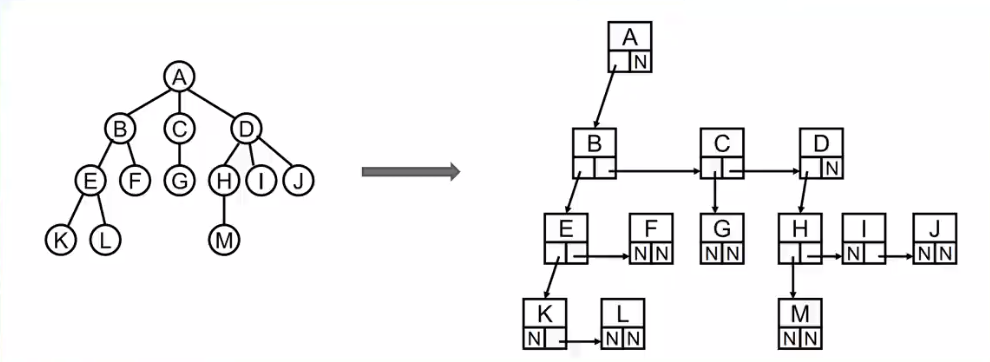


儿子-兄弟表示法旋转

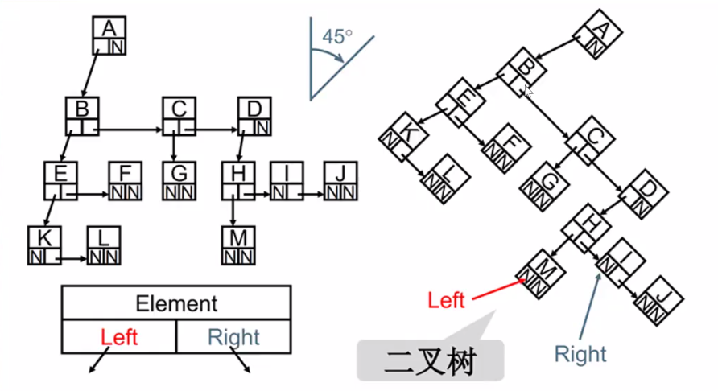

- 规律：所有的树都可以使用**二叉树**模拟出来


### 二叉树

树中每个节点最多只能有两个子节点，即是二叉树。

二叉树的特性：

-  一个二叉树第i层的最大节点数：`2^(i-1)，i>=1`

- 深度为k的二叉树有最大节点总数：`2^k-1,k>=1`

- 对任何非空二叉树T，若n0表示叶节点的个数，n2是度为2的非叶节点个数，那么二者满足关系`n0=n2+1`

完美二叉树：

- 除了最下一层的叶节点外，每层节点都有2个子节点，构成满二叉树

完全二叉树：

- 除二叉树最后一层外，其他各层的节点数都达到最大个数
- 最后一层从左向右的叶节点连续存在，只缺右侧若干节点
- 完美二叉树是特殊的完全二叉树


### 二叉树的存储

二叉树可以用数组和链表存储。

二叉树最常见的存储方式是使用链表存储。

- 每个节点封装成一个Node，Node中包含存储的数据、左节点的引用、右节点的引用

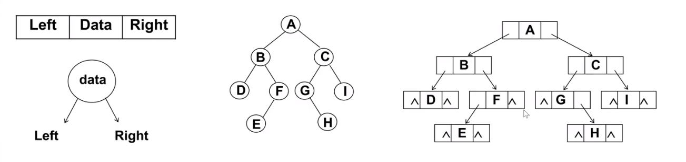

### 二叉搜索树

#### 什么是二叉搜索树？

二叉搜索树（BST，Binary Search Tree），也称二叉排序树、二叉查找树。

二叉搜索树：

- 可以为空
- 如果不为空，满足以下性质：
  - 非空左子树的所有键值小于其根节点的键值
  - 非空右子树的所有键值大于其根节点的键值
  - 左右子树本身也是二叉搜索树

二叉搜索树的特点：

- 相对较小（相对父节点）的值总是保存在左节点上，相对较大的值总是保存在右节点上。
- 大大提高查找效率，二分查找的思想


#### 二叉搜索树的封装

```javascript
function BinarySerachTree() {
  this.root = null

  function Node(key) {
    this.key = key
    this.left = null
    this.right = null
  }
}
```


#### 二叉搜索树的常见操作

- `insert(key)`
- `search(key)`
- `delete(key)`
- `tranverse`--遍历
  - `inOrderTraversal`--中序遍历
  - `preOrderTraversal`--先序遍历
  - `postOrderTraversal`--后序遍历

- `min()`
- `max()`
- `remove(key)`

#### 插入方法

```javascript
BinarySerachTree.prototype.insert = function(key) {
  var newNode = new Node(key)
  if (this.root === null) {
    this.root = newNode
  } else {
    this.insertNode(this.root, newNode)
  }
}

BinarySerachTree.prototype.insertNode = function(node, newNode) {
  if (newNode.key < node.key) {
    if (node.left === null) {
      node.left = newNode
    } else {
      this.insertNode(node.left, newNode)
    }
  } else {
    if (node.right === null) {
      node.right = newNode
    } else {
      this.insertNode(node.right, newNode)
    }
  }
}
```


#### 遍历方法

树的遍历：访问树的每个节点。

常见方式：

- 先序遍历
  - 访问根节点
  - 先序遍历其左子树
  - 先序遍历其右子树
- 中序遍历
  - 中序遍历其左子树
  - 访问根节点
  - 中序遍历其右子树
- 后序遍历
  - 后序遍历其左子树
  - 后序遍历其右子树
  - 访问根节点
- 层序遍历


先序遍历的代码实现

```javascript
BinarySerachTree.prototype.preOrderTraversal = function(handler) {
  this.preOrderTraversalNode(this.root, handler)
}

BinarySerachTree.prototype.preOrderTraversalNode = function(node, handler) {
  if (node !== null) {
    handler(node.key)
    this.preOrderTraversalNode(node.left, handler)
    this.preOrderTraversalNode(node.right, handler)
  }
}
```


中序遍历的代码实现

```javascript
BinarySerachTree.prototype.postOrderTraversal = function(handler) {
  this.postOrderTraversalNode(this.root, handler)
}

BinarySerachTree.prototype.postOrderTraversalNode = function(node, handler) {
  if (node !== null) {
    this.postOrderTraversalNode(node.left, handler)
    handler(node.key)
    this.postOrderTraversalNode(node.right, handler)
  }
}
```


后序遍历的代码实现

```javascript
BinarySerachTree.prototype.midOrderTraversal = function(handler) {
  this.midOrderTraversalNode(this.root, handler)
}

BinarySerachTree.prototype.midOrderTraversalNode = function(node, handler) {
  if (node !== null) {
    this.midOrderTraversalNode(node.left, handler)
    this.midOrderTraversalNode(node.right, handler)
    handler(node.key)
  }
}
```


#### 最大值和最小值

```javascript
BinarySerachTree.prototype.min = function() {
  var current = this.root
  while(current.left !== null) {
    current = current.left
  }
  return current.key
}

BinarySerachTree.prototype.max = function() {
  var current = this.root
  while(current.right !== null) {
    current = current.right
  }
  return current.key
}
```


#### 搜索特定的值

```javascript
BinarySerachTree.prototype.search = function(key) {
  var node = this.root
  while(node) {
    if (key < node.key) {
      node = node.left
    } else if (key > node.key) {
      node = node.right
    } else {
      return true
    }
  }
  return false
}
```


#### 删除方法

- 删除节点要从查找要删的节点开始，找到节点后，需考虑三种情况：
  - 该节点是叶节点
  - 该节点只有一个子节点
  - 该节点有两个子节点（情况复杂）
- 过程：
  - 先找到要删除的节点，如果没有找到，不需要删除
  - 找到要删除的节点
    - 删除叶子节点
    - 删除只有一个子节点的节点
    - 删除有两个子节点的节点

```javascript
BinarySerachTree.prototype.delete = function(key) {
  var node = this.root
  var parentNode
  var isLeft = true

  while(node.key !== key) {
    parentNode = node
    if (key < node.key) {
      node = node.left
      isLeft = true
    } else if (key > node.key) {
      node = node.right
      isLeft = false
    } 

    if (node === null) return false
  }

  if (node.left === null && node.right === null) { // 1. 该节点是叶节点
    if(isLeft) {
      parentNode.left = null
    } else {
      parentNode.right = null
    }
  } else if (node.left === null) { // 2. 该节点只有一个子节点
    if (node === this.root) {
      this.root = node.right
    } else if (isLeft) {
      parentNode.left = node.right
    } else {
      parentNode.right = node.right
    }
  } else if (node.right === null) { 
    if (node === this.root) {
      this.root = node.left
    } else if (isLeft) {
      parentNode.left = node.left
    } else {
      parentNode.right = node.left
    }
  } else { // 3. 该节点有两个子节点 
    var successor = this.getSuccessor(node)
    if (node === this.root) {
      this.root = successor
    }
    if (isLeft) {
      parentNode.left = successor
    } else {
      parentNode.right = successor
    }
    successor.left = node.left
  }
  return true
}
```

获取后继节点：

```javascript
// 获取后继节点，找到待删除节点后集结点中右子树的最小值/或是左子树的最大值
BinarySerachTree.prototype.getSuccessor = function(delNode) {
  var successorParent = delNode
  var successor = delNode
  var current = delNode.right
  while(current !== null) {
    successorParent = successor
    successor = current
    current = current.left
  }

  console.log(successor)
  console.log(successorParent)
  // 待删除节点的右子树重新生成
  if (delNode !== successorParent) {

    successorParent.left = successor.right
    successor.right = delNode.right
  }

  console.log(successor)
  return successor
}
```


#### 完整代码

```javascript
function BinarySerachTree() {
  this.root = null

  function Node(key) {
    this.key = key
    this.left = null
    this.right = null
  }

  BinarySerachTree.prototype.insert = function(key) {
    var newNode = new Node(key)
    if (this.root === null) {
      this.root = newNode
    } else {
      this.insertNode(this.root, newNode)
    }
  }

  BinarySerachTree.prototype.insertNode = function(node, newNode) {
    if (newNode.key < node.key) {
      if (node.left === null) {
        node.left = newNode
      } else {
        this.insertNode(node.left, newNode)
      }
    } else {
      if (node.right === null) {
        node.right = newNode
      } else {
        this.insertNode(node.right, newNode)
      }
    }
  }

  BinarySerachTree.prototype.preOrderTraversal = function(handler) {
    this.preOrderTraversalNode(this.root, handler)
  }

  BinarySerachTree.prototype.preOrderTraversalNode = function(node, handler) {
    if (node !== null) {
      handler(node.key)
      this.preOrderTraversalNode(node.left, handler)
      this.preOrderTraversalNode(node.right, handler)
    }
  }

  BinarySerachTree.prototype.postOrderTraversal = function(handler) {
    this.postOrderTraversalNode(this.root, handler)
  }

  BinarySerachTree.prototype.postOrderTraversalNode = function(node, handler) {
    if (node !== null) {
      this.postOrderTraversalNode(node.left, handler)
      this.postOrderTraversalNode(node.right, handler)
      handler(node.key)
    }
  }

  BinarySerachTree.prototype.midOrderTraversal = function(handler) {
    this.midOrderTraversalNode(this.root, handler)
  }

  BinarySerachTree.prototype.midOrderTraversalNode = function(node, handler) {
    if (node !== null) {
      this.midOrderTraversalNode(node.left, handler)
      handler(node.key)
      this.midOrderTraversalNode(node.right, handler)
    }
  }

  BinarySerachTree.prototype.min = function() {
    var current = this.root
    while(current.left !== null) {
      current = current.left
    }
    return current.key
  }

  BinarySerachTree.prototype.max = function() {
    var current = this.root
    while(current.right !== null) {
      current = current.right
    }
    return current.key
  }

  BinarySerachTree.prototype.search = function(key) {
    var node = this.root
    while(node) {
      if (key < node.key) {
        node = node.left
      } else if (key > node.key) {
        node = node.right
      } else {
        return true
      }
    }
    return false
  }

  BinarySerachTree.prototype.delete = function(key) {
    var node = this.root
    var parentNode
    var isLeft = true

    while(node.key !== key) {
      parentNode = node
      if (key < node.key) {
        node = node.left
        isLeft = true
      } else if (key > node.key) {
        node = node.right
        isLeft = false
      } 

      if (node === null) return false
    }
    
    if (node.left === null && node.right === null) { // 1. 该节点是叶节点
      if(isLeft) {
        parentNode.left = null
      } else {
        parentNode.right = null
      }
    } else if (node.left === null) { // 2. 该节点只有一个子节点
      if (node === this.root) {
        this.root = node.right
      } else if (isLeft) {
        parentNode.left = node.right
      } else {
        parentNode.right = node.right
      }
    } else if (node.right === null) { 
      if (node === this.root) {
        this.root = node.left
      } else if (isLeft) {
        parentNode.left = node.left
      } else {
        parentNode.right = node.left
      }
    } else { // 3. 该节点有两个子节点 
      var successor = this.getSuccessor(node)
      if (node === this.root) {
        this.root = successor
      }
      if (isLeft) {
        parentNode.left = successor
      } else {
        parentNode.right = successor
      }
      successor.left = node.left
    }
    return true
  }

  // 获取后继节点
  BinarySerachTree.prototype.getSuccessor = function(delNode) {
    var successorParent = delNode
    var successor = delNode
    var current = delNode.right
    while(current !== null) {
      successorParent = successor
      successor = current
      current = current.left
    }

    console.log(successor)
    console.log(successorParent)
    if (delNode !== successorParent) {
      
      successorParent.left = successor.right
      successor.right = delNode.right
    }

    return successor
  }
}
```


#### 测试

```javascript
var bst = new BinarySerachTree()
bst.insert(11)
bst.insert(8)
bst.insert(6)
bst.insert(2)
bst.insert(15)
bst.insert(24)
bst.insert(12)
bst.insert(7)
bst.insert(10)
var preStr = ""
bst.preOrderTraversal(function(value) {
  preStr += value + " "
})
console.log(preStr)

var postStr = ""
bst.postOrderTraversal(function(value) {
  postStr += value + " "
})
console.log(postStr)

var midStr = ""
bst.midOrderTraversal(function(value) {
  midStr += value + " "
})
console.log(midStr)

console.log(bst.min())
console.log(bst.max())

console.log(bst.search(8))
console.log(bst.search(25))

console.log(bst.delete(6))
var preStr = ""
bst.preOrderTraversal(function(value) {
  preStr += value + " "
})
console.log(preStr)

bst.insert(6)
console.log(bst.delete(8))
var preStr = ""
bst.preOrderTraversal(function(value) {
  preStr += value + " "
})
console.log(preStr)
```


## 红黑树

### 为什么需要红黑树？

二叉搜索树的缺陷

- 当插入的数据是有序的数据，如下图：

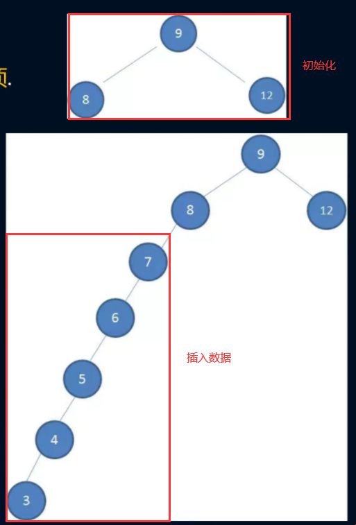

- 成为非平衡树：
  - 比较好的二叉搜索树数据应该是左右分布均匀的
  - 但插入连续的数据后，分布的不均匀，这种树为非平衡树
  - 对于一个平衡树来说，插入/查找的操作效率是`O(logN)`
  - 对于一个非平衡二叉树，相当于一个链表，查找效率是`O(N)`


为了能在较快的时间`O(longN)`来操作一个树，需要保持树总是平衡的：

- 至少大部分时间都是平衡的，时间复杂度接近`O(logN)`
- 树中每个节点左边的子孙节点个数，应尽可能等于右边的子孙节点个数
- 常见平衡树：
  - AVL树
  - 红黑树--插入/删除操作，红黑树的性能要优于AVL树，最为常用

### 红黑树的规则

1、除了符合二叉搜索树的基本规则外，还添加了一些特性：

- 节点是红色或黑色
- 根节点是黑色
- 每个叶子节点都是黑色的空节点（NIL节点）
- 每个红色节点的两个子节点都是黑色（从每个叶子到根的所有路径上不能有两个连续的红色节点）
- 从任一节点到其每个叶子的所有路径都包含相同数目的黑色节点

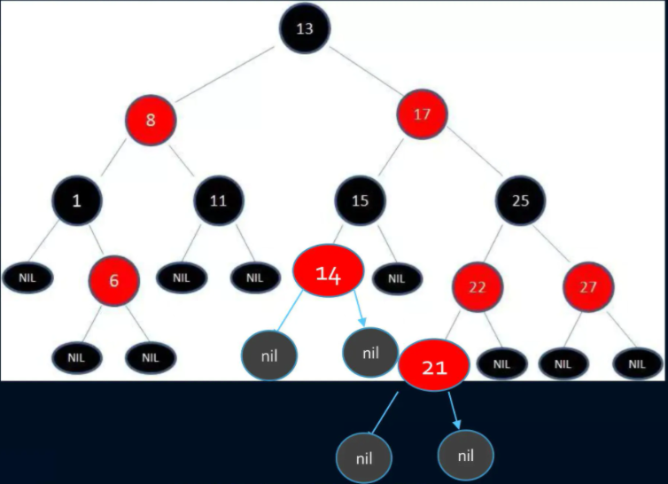

2、红黑树怎么相对平衡？

红黑树关键特性：

- 从根到叶子的**最长可能路径，不会超过最短可能路径的两倍**长
  - 性质4决定了路径不能有两个相连的红色节点
  - 最短的可能路径都是黑色节点
  - 最长的可能路径时红色和黑色交替
  - 性质5所有路径都有相同数目的黑色节点
  - 表明了没有路径能超过其他路径的两倍长


### 红黑色的变换

插入新节点时，可通过 变色 -- 左旋转 -- 右旋转

1、变色

为了重新红黑树的规则，尝试把红色节点变为黑色，或者把黑色节点变为红色

- 插入的新节点通常都是红色节点
  - 插入红色节点，有可能插入一次是不违反红黑树任何规则的
  - 插入黑色节点，必然会导致有一个路径上多了黑色节点，很难调整
  - 红色节点可能出现红红相连的情况，但这种情况可以通过颜色调换和旋转来调整

2、左旋转

逆时针旋转红黑树的两个节点，使父节点被自己的右孩子取代，而自己成为自己的左孩子。

图中，身为右孩子的Y取代了X的位置，而X变成了Y的左孩子，b成为X的右孩子。

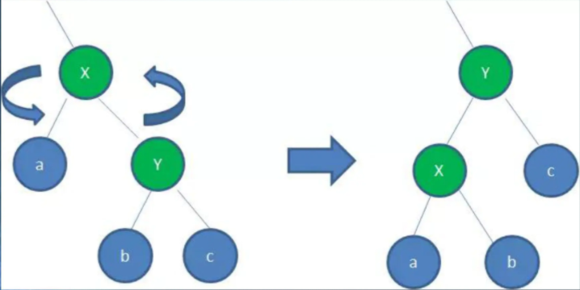

3、右旋转

顺时针旋转红黑树的两个节点，使得父节点被自己的左孩子取代，而自己成为自己的右孩子。

图中，身为左孩子的Y取代了X的位置，而X变成了Y的右孩子，c移至成为X的左孩子

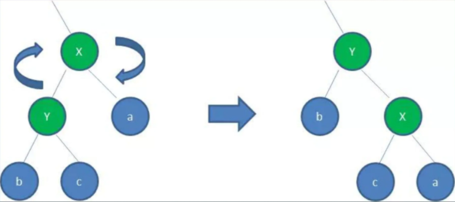

### 红黑树的插入操作

五种情况

1、情况一

- 表现：新节点N位于树的根上，没有父节点
- 操作：直接将红色变换成黑色即可

2、情况二

- 表现：新节点的父节点P是黑色

3、情况三

- 表现：父红叔红祖黑
- 方案：**-->** 父黑叔黑 祖红
- 操作：
  - P、U变换为黑色，G变换为红色
- 可能出现的问题

4、情况四

- 表现：父红叔黑祖黑，N是左儿子
- 方案：**-->** 父黑祖红，右旋转
- 操作：

5、情况五

- 表现：父红叔黑祖黑，N是右儿子
- 方案：
  - 以P为根进行左旋转，将P作为新插入的红色节点考虑
  - 父变黑，祖变红，以祖为根进行右旋转

### 红黑树案例

案例：依次插入 10 9 8 7 6 5 4 3 2 1


### 红黑树的插入和删除的代码实现


## 图论

### 什么是图？

1、图结构的基本概念

图结构是一种与树结构有些相似的数据结构。

图论是数学的一个分支，并且在数学的概念上，树是图的一种。

它以图为研究对象，研究顶点和边组成的图形的数学理论和方法。

主要研究的目的是事物之间的关系，点代表事物，边代表关系。

2、现实案例：

- 人与人的关系网
- 地铁
- 村庄间的关系网

3、图的术语

- 顶点
- 边
- 相邻顶点
- 度：一个顶点的度时相邻顶点的数量
- 路径
  - 简单路径：要求不包含重复的顶点
  - 回路：第一个顶点和最后一个顶点相同的路径
- 有向图
- 无向图
- 无权图
- 带权图
  - 边有一定的权重
  - 这里的权重可以是任意你希望表示的数据


### 图的表示

1、邻接矩阵

2、邻接表

问题：

计算“出度”比较简单（出度：指向别人的数量，入度：指向自己的数量）


### 图结构封装

```javascript
function Graph() {
  this.vertexes = []
  this.adjList = new Dictionary()
  
   // 添加节点
  Graph.prototype.addVertex = function(v) {
    this.vertexes.push(v)
    this.adjList.set(v, [])
  }

  // 添加节点的相邻节点
  Graph.prototype.addEdge = function(v1, v2) {
    this.adjList.get(v1).push(v2)
    this.adjList.get(v2).push(v1)
  }
}
```

#### `toString`方法

```javascript
// 将图转化为字符串
Graph.prototype.toString = function() {
  var resultStr = ""
  for (var i=0; i < this.vertexes.length; i++) {
    resultStr += this.vertexes[i] + "-->"
    var adj = this.adjList.get(this.vertexes[i])
    for (var j=0; j < adj.length; j++) {
      resultStr += adj[j] + " "
    }
    resultStr += '\n'
  }
  return resultStr
}
```

#### 图的遍历

1、图的遍历思想：

和树的遍历思想是一样的；

意味着需要将图中每个顶点访问一遍，并且不能有重复的访问。

2、遍历的两种算法：

广度优先搜索

深度优先搜索

注：明确指定第一个被访问的顶点

3、广度优先搜索算法

```javascript
// 广度优先搜索 Breadth-First Search
Graph.prototype.bfs = function(v, handler) {
  var colors = this.initializeColor()
  var queue = new Queue()
  queue.enqueue(v)
  while (!queue.isEmpty()) {
    // 获取节点v的相邻节点
    var qv = queue.dequeue(v)
    var adj = this.adjList.get(qv)
    console.log(adj)
    colors[qv] = 'gray'
    // 将节点v的相邻节点逐个放入queue中，修改相邻节点的颜色为'grey'
    for (var i = 0; i < adj.length; i++) {
      var a = adj[i]
      if (colors[a] === 'white') {
        colors[a] = 'gray'
        queue.enqueue(a)
      }
    }
    colors[qv] = 'black'

    if (handler) {
      handler(qv)
    }
  }
}
```


4、深度优先搜索算法 ---- **有待理解**

```javascript
// 深度优先搜索 Depth-First Search
Graph.prototype.dfs = function(handler) {
  var colors = this.initializeColor()
  for (var i=0; i < this.vertexes.length; i++) {
    if (colors[this.vertexes[i]] === 'white') {
      this.dfsVisit(this.vertexes[i], colors, handler)
    }
  }
}

Graph.prototype.dfsVisit = function(u, colors, handler) {
  colors[u] = "gray"
  if (handler) {
    handler(u)
  }
  var uAdj = this.adjList.get(u)
  for (var i=0; i < uAdj.length; i++) {
    var a = uAdj[i]
    if (colors[a] === 'white') {
      this.dfsVisit(a, colors, handler) 
    }
  }
  colors[u] = 'black'
}
```

### 测试

```javascript
var graph = new Graph()
var myVertexes = ['A', 'B', 'C', "D", "E", "F", "G", "H", "I"]
myVertexes.forEach(item => {
  graph.addVertex(item)
})
console.log(graph)
graph.addEdge('A', 'B')
graph.addEdge('A', 'C')
graph.addEdge('A', 'D')
graph.addEdge('B', 'E')
graph.addEdge('B', 'F')
graph.addEdge('C', 'D')
graph.addEdge('C', 'G')
graph.addEdge('D', 'G')
graph.addEdge('D', 'H')
graph.addEdge("E", 'I')

console.log(graph.toString())

console.log(graph.initializeColor())

var result = ""
graph.bfs('A', function(v) {
  result += v + " "

})
console.log(result)

var result = ""
graph.dfs(function(v) {
  result += v + " "
})
console.log(result)
```


## 排序算法

### 大O表示法

常见大O表示形式

- O(1)：常数的
- O(log(N))：对数的
- O(n)：线性的
- O(nlog(N))：线性和对数的乘积
- O(n^2)：平方
- O(2^n)：指数的

推导大O表示法的方式：

- 用常量1取代运行时间中所有的加法常量
- 用修改后的运行次数函数中，只保留最高阶项
- 如果最高存在且不为1，则去除与这个项相乘的常数

### 认识排序算法

排序算法有很多：冒泡排序、选择排序、插入排序、归并排序、计数排序(counting sort)、基数排序(radix sort)、希尔排序、堆排序、筒排序。

简单排序：冒泡排序、选择排序、插入排序

高级排序：希尔排序、快速排序

### ArrayList类封装

```javascript
function ArrayList() {
  this.array = []

  ArrayList.prototype.insert = function(item) {
    this.array.push(item)
  }

  ArrayList.prototype.toString = function() {
    return this.array.join("-")
  }
  
  ArrayList.prototype.swap = function(m, n) {
    var temp = this.array[m]
    this.array[m] = this.array[n]
    this.array[n] = temp
  }
}
```


### 排序算法代码实现

#### 冒泡排序

原理：

- 第一次循环：
  - 比较位置1和位置2的数字，如果Num1 > Num2，交换位置
  - 比较位置2和位置3的数字，如果Num2 > Num3，交换位置
  - ... 通过依次比较相邻两个数字，将最大值冒泡至最后一个位置
- 第二次循环：
  - 比较位置1和位置2的数字，如果Num1 > Num2，交换位置
  - ...比较位置8和位置9的数字，如果Num8 > Num9，交换位置
  - 通过依次比较相邻两个数字，将最大值冒泡至倒数第二个位置

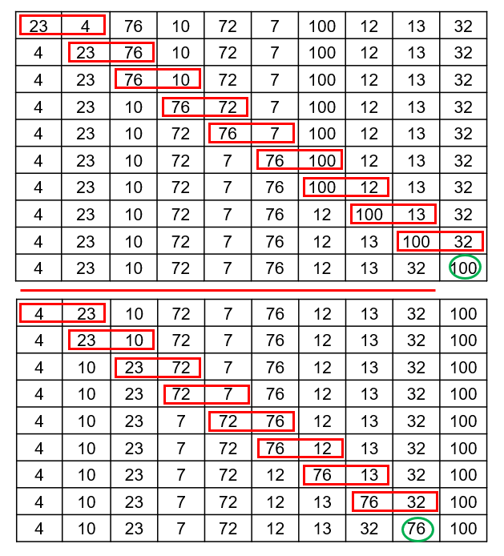

```javascript
// 冒泡排序
// 原理：循环对比相邻两个数，按顺序交换位置
ArrayList.prototype.bubbleSort = function() {
  for (var j = this.array.length-1; j >= 0; j--) {
    for (var i=0; i < j; i++) {
      if (this.array[i] > this.array[i+1]) {
        this.swap(i, i+1)
      }
    }
  }
}
```

效率：

- 比较次数
  - 冒泡排序的比较次数：`(N-1)+(N-2)+(N-3)+...+1 = N*(N-1)/2`
  - 大O表示法：O(N^2) 
- 交换次数
  - 冒泡排序的交换次数：`N*(N-1)/4`
  - 大O表示法：O(N^2) 

#### 选择排序

思路：

- 取出第一个元素，记录minIndex=0，与后边的元素依次比较
  - 当后面的元素<第一个元素时，,设置minIndex=对应元素的索引值
  - 经过一轮比较后，获取最小值对应的minIndex
  - 交换索引值为minIndex和0的位置，使第一个元素最小
- 取出第二个元素，记录minIndex=1，与后边的元素依次比较
  - 当后面的元素<第一个元素时，,设置minIndex=对应元素的索引值
  - 经过一轮比较后，获取最小值对应的minIndex
  - 交换索引值为minIndex和0的位置，使第二个元素最小
- 使用同样的方法比较剩余的元素

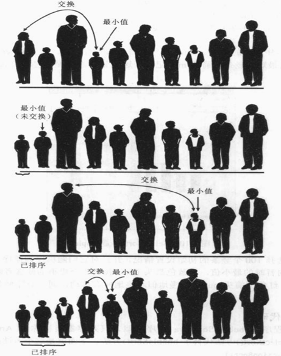

```javascript
ArrayList.prototype.selectionSort = function() {
  var length = this.array.length
  for (var i = 0; i < length-1; i++) {
    var minIndex = i
    for (var j = i+1; j < length; j++) {
      if (this.array[minIndex] > this.array[j]) {
        minIndex = j
      }
    }

    this.swap(i, minIndex)
  }
}
```

效率：

- 比较次数
  - 选择排序的真实比较次数： `N*(N-1)/2`
  - 大O表示法：O(N^2) 
- 交换次数
  - 选择排序的真实交换次数：N
  - 大O表示法：O(N) 
- 执行效率高于冒泡排序


#### 插入排序

核心是局部有序：假设被标记的数据左侧局部有序

思路：

- 取出第一个元素，认定该元素局部有序
- 取出第二个元素（a），在左侧已经排序的元素序列中从后向前扫描，直到a>扫描元素
  - 如果a<扫描元素，扫描元素向前移动
  - 如果a>扫描元素，将a插入该位置
- 重复上一个步骤

图解：

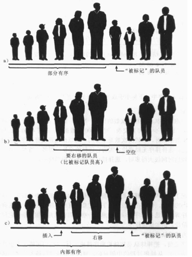

```javascript
ArrayList.prototype.insertSort = function() {
  var length = this.array.length
  for (var i=1; i < length; i++ ) {
    var temp = this.array[i]
    var j = i
    while (j > 0 && this.array[j-1] > temp) {
      this.array[j] = this.array[j-1] 
      j--
    }
    this.array[j] = temp
  }
}
```

效率：

- 比较次数
  - 插入排序的最多比较次数： `1+2+3+...+(n-1) = N*(N-1)/2`
  - 平均比较次数： `N*(N-1)/4`
- 复制次数
  - 插入排序的最多复制次数： `1+2+3+...+(n-1) = N*(N-1)/2`
  - 平均复制次数： `N*(N-1)/4`
- 执行效率高于选择排序

#### 希尔排序

希尔排序是插入排序的一种高效的改进版，并且效率比插入排序更快。

对于数字：81, 94, 11, 96, 12, 35, 17, 95, 28, 58, 41, 75, 15

- 思路
  - 先让间隔为6
    - 进行分组：(81，17,  15)，(94，95)，(11，28)，(96，58)，(12，41)，(35，75)
    - 进行排序：(15，17,  81)，(94，95)，(11，28)，(58，96)，(12，41)，(35，75)
    - 排序后的新序列, 一定可以让数字离自己的正确位置更近一步
  - 间隔为3
    - 进行分组：(15, 94, 28, 12, 75)，(17, 95, 58, 41)，(81, 11, 96, 35)
    - 进行排序：(12, 15, 28, 75, 94)，(17, 41, 58, 95)，(11, 35, 81, 96)
    - 排序后的新序列, 一定可以让数字离自己的正确位置更近一步
  - 间隔为1
    - 分组为：12, 17, 11, 15, 41, 35, 28, 58, 81, 75, 95, 96, 94
- 增量
  - 原稿中的增量：初始间距是N/2
  - Hibbard增量：2^k-1
  - Sedgewick增量序列

```javascript
ArrayList.prototype.shellSort = function() {
  var length = this.array.length
  var gap = Math.floor(length / 2)
  while (gap > 0) {
    for (var i=gap; i < length; i++) {
      var j = i
      var temp = this.array[j]
      while(j > gap-1 && this.array[j-gap] > temp) {
        this.array[j] = this.array[j-gap]
        j -= gap
      }
      this.array[j] = temp
    }
    gap = Math.floor(gap / 2)
  }
}
```

效率

- 经统计，使用原始增量，最坏的情况下时间复杂度为`(N^2)`，通常情况下效率要好于`O(N^2)`

- 大多数情况下效率高于简单排序


#### 快速排序

非常重要

快速排序：冒泡排序的升级版

核心思想：

- 分而治之

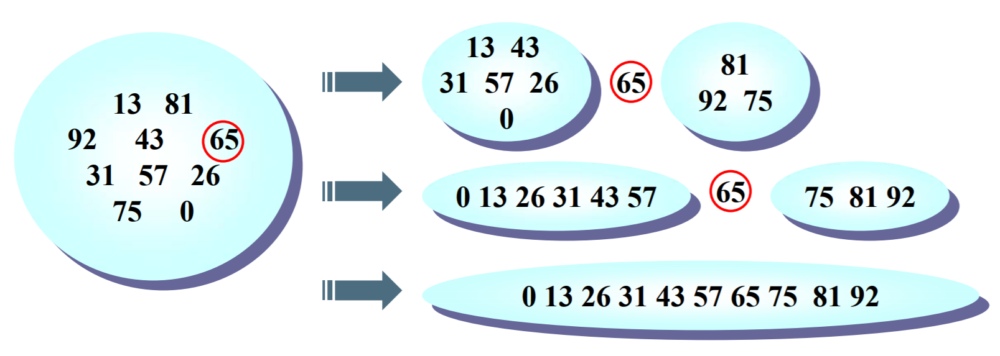

- 选择枢纽`pivot`
  - 取头、中、尾的中位数作为枢纽。

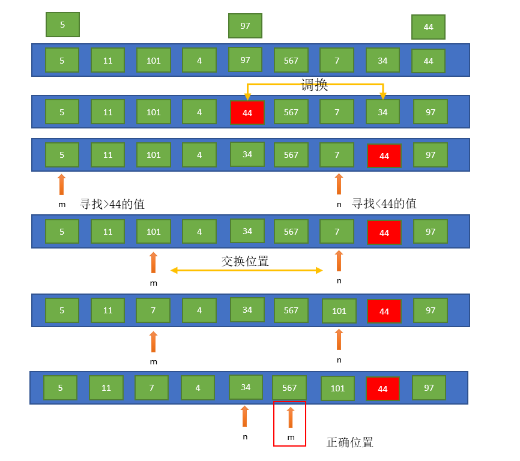

```javascript
// 快速排序，寻找枢纽，分而治之
ArrayList.prototype.quickSort = function() {
  this.quickSortRec(0, this.array.length-1)
}

ArrayList.prototype.median = function(left, right) {
  var center = Math.floor((left + right) / 2)

  if (this.array[left] > this.array[center]) {
    this.swap(left, center)
  }
  if (this.array[center] > this.array[right]) {
    this.swap(center, right)
  }
  if (this.array[left] > this.array[center]) {
    this.swap(left, center)
  }

  this.swap(center, right-1)

  return this.array[right-1]
}

ArrayList.prototype.quickSortRec = function(left, right) {
  if (left >= right || left+1 === right) return 
  var pivot = this.median(left, right)
  var lp = left
  var rp = right-1
  while(true) {
    while(this.array[++lp] < pivot) {}
    while(this.array[--rp] > pivot) {}
    if (lp < rp) {
      this.swap(lp, rp)
    } else {
      break
    }
  }
  console.log(pivot, lp)
  this.swap(lp, right-1)
  this.quickSortRec(left, lp-1)

  this.quickSortRec(lp+1, right)
}
```


### 完整代码

```javascript
function ArrayList() {
  this.array = []

  ArrayList.prototype.insert = function(item) {
    this.array.push(item)
  }

  ArrayList.prototype.toString = function() {
    return this.array.join("-")
  }

  ArrayList.prototype.swap = function(m, n) {
    var temp = this.array[m]
    this.array[m] = this.array[n]
    this.array[n] = temp
  }

  // 冒泡排序
  // 原理：循环对比相邻两个数，按顺序交换位置
  ArrayList.prototype.bubbleSort = function() {
    for (var j = this.array.length-1; j >= 0; j--) {
      for (var i=0; i < j; i++) {
        if (this.array[i] > this.array[i+1]) {
          this.swap(i, i+1)
        }
      }
    }
  }

  // 选择排序
  ArrayList.prototype.selectionSort = function() {
    var length = this.array.length
    for (var i = 0; i < length-1; i++) {
      var minIndex = i
      for (var j = i+1; j < length; j++) {
        if (this.array[minIndex] > this.array[j]) {
          minIndex = j
        }
      }

      this.swap(i, minIndex)
    }
  }

  // 插入排序
  ArrayList.prototype.insertSort = function() {
    var length = this.array.length
    for (var i=1; i < length; i++ ) {
      var temp = this.array[i]
      var j = i
      while (j > 0 && this.array[j-1] > temp) {
        this.array[j] = this.array[j-1] 
        j--
      }
      this.array[j] = temp
    }
  }

  // 希尔排序
  ArrayList.prototype.shellSort = function() {
    var length = this.array.length
    var gap = Math.floor(length / 2)
    while (gap > 0) {
      for (var i=gap; i < length; i++) {
        var j = i
        var temp = this.array[j]
        while(j > gap-1 && this.array[j-gap] > temp) {
          this.array[j] = this.array[j-gap]
          j -= gap
        }
        this.array[j] = temp
      }
      gap = Math.floor(gap / 2)
    }
  }

  // 快速排序，寻找枢纽，分而治之
  ArrayList.prototype.quickSort = function() {
    this.quickSortRec(0, this.array.length-1)
  }

  ArrayList.prototype.median = function(left, right) {
    var center = Math.floor((left + right) / 2)

    if (this.array[left] > this.array[center]) {
      this.swap(left, center)
    }
    if (this.array[center] > this.array[right]) {
      this.swap(center, right)
    }
    if (this.array[left] > this.array[center]) {
      this.swap(left, center)
    }
    
    this.swap(center, right-1)

    return this.array[right-1]
  }
	
  // 快速排序
  ArrayList.prototype.quickSortRec = function(left, right) {
    if (left >= right || left+1 === right) return 
    var pivot = this.median(left, right)
    var lp = left
    var rp = right-1
    while(true) {
      while(this.array[++lp] < pivot) {}
      while(this.array[--rp] > pivot) {}
      if (lp < rp) {
        this.swap(lp, rp)
      } else {
        break
      }
    }
    console.log(pivot, lp)
    this.swap(lp, right-1)
    this.quickSortRec(left, lp-1)

    this.quickSortRec(lp+1, right)
  }
}
```

### 测试

```javascript
var al = new ArrayList()
al.insert(97)
al.insert(11)
al.insert(88)
al.insert(101)
al.insert(44)
al.insert(5)
al.insert(567)
al.insert(7)
al.insert(34)
al.insert(4)

console.log(al.toString())

// al.bubbleSort()
// console.log(al.toString())

// al.selectionSort()
// console.log(al.toString())

// al.selectionSort()
// console.log(al.toString())

// al.shellSort()
// console.log(al.toString())

al.quickSort()
console.log(al.toString())
```

