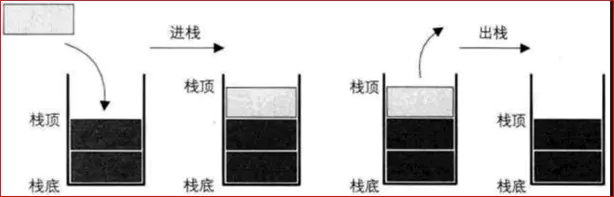
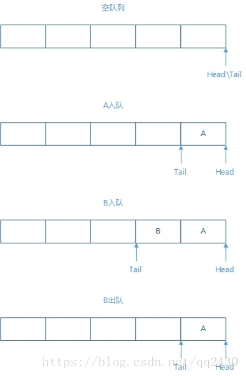
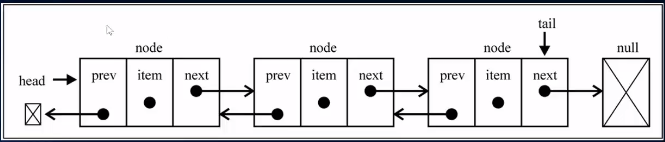
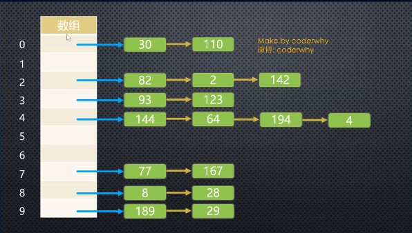
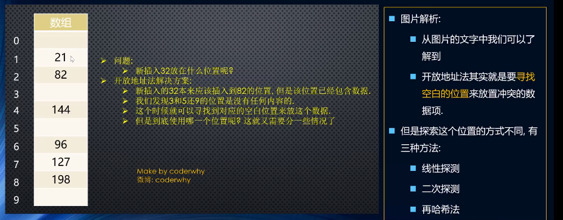

# 算法（algorithm）

## 数组


## 栈结构

### 什么是栈结构

栈，是一种受运算限制的线性表

- 后进先出（LIFO--last in first out）
- 限制：仅允许在表的一端进行插入和删除运算。这一端是栈顶，另一端是栈底。
- 进栈：把新元素放到栈顶元素的上面，使之成为新的栈顶元素。
- 出栈：把栈顶元素删除掉，使其相邻的元素成为新的栈顶元素。



### 栈结构的封装

```javascript
function Stack() {
    this.items = []
    
    Stack.prototype.push = function(item) {
      return this.items.push(item)
    }

    Stack.prototype.pop = function() {
      return this.items.pop()
    }

    Stack.prototype.top = function() {
      return this.items[this.items.length-1]
    }

    Stack.prototype.size = function() {
      return this.items.length
    }

    Stack.prototype.isEmpty = function() {
      return !this.items.length
    }

    Stack.prototype.toString = function() {
      var formatStr=''
      for(var i=0; i<this.items.length; i++) {
        formatStr = formatStr + this.items[i]
      }
      return formatStr
    }
  }
```


### 栈-十进制转二进制

```javascript
function decimal2Binary(value) {
    var stack = new Stack()
    while (value >= 1) {
      value = Math.floor(value / 2)
      remainder = value % 2
      stack.push(remainder)
    }
    return stack.toString()
  }
```

### 栈-中缀表达式转为后缀表达式


## 队列

### 什么是队列结构

队列结构，也是一种线性表。

- 允许在队尾插入元素，在队首删除元素，FIFO（first in first out）



### 队列结构的封装

常见操作：

- enqueue(element)
- dequeue
- front
- isEmpty 
- size
- toString

```javascript
function Queue() {
    this.items = []

    Queue.prototype.enqueue = function(item) {
        return this.items.push(item)
    }

    Queue.prototype.dequeue = function() {
        return this.items.shift()
    }

    Queue.prototype.front = function() {
        return this.items[0]
    }

    Queue.prototype.isEmpty = function() {
        return !this.items.length
    }

    Queue.prototype.size = function() {
        return this.items.length
    }

    Queue.prototype.toString = function() {
        var formatStr = ''
        for(var i=0; i<this.items.length; i++) {
            formatStr = formatStr + this.items[i] + " "
        }
        return formatStr
    }
}
```


### 队列-击鼓传花

```javascript
function game(nameList, num) {
    var queue = new Queue()
    for (let i=0; i<nameList.length; i++) {
        queue.enqueue(nameList[i])
    }
    
    while (queue.size() > 1) {
        for (let i=0; i<num-1; i++) {
            queue.enqueue(queue.dequeue())
        }
        queue.dequeue()
    }
    return queue.front()
}
game(['熊大', '熊二', '熊三', '熊四', '熊五'], 4)
```


## 优先级队列

### 什么是优先级队列？


### 优先级队列的封装及实现

```javascript
function PriorityQueue() {
    
    function QueueElement(element, priority) {
        this.element = element
        this.priority = priority
	}
    
    this.items = []
    PriorityQueue.prototype.enqueue = function(element, priority) {
        var queueElement = new QueueElement(element, priority)
        
        if (this.items.length === 0) {
            this.items.push(queueElement)
        } else {
            var added = false
            for (var i=0; i<this.items.length; i++) {
                if (queueElemnt.priority < this.items[i].priority) {
                    this.items.splice(i, 0, queueElement)
                    added = true
                    break
                }
            }
            if (!added) {
                this.items.push(queueElement)
            }
        }
    }
}
```


## 链表结构

### 什么是链表结构

- 链表的优点
- 链表的缺点


### 链表结构的常见操作

- append(element)
- insert(position, element)
- get(position)
- indexOf(element)
- update(data, position)
- removeAt(position)
- remove(element)
- isEmpty()
- size()
- toString()

### 链表的封装

```javascript
function LinkedList() {
    function Node(data) {
      this.data = data
      this.next = null
    }

    this.head = null
    this.length = 0
  }

```

#### append

```javascript
LinkedList.prototype.append = function(data) {
    var node = new Node(data)
    if (this.head === null) {
        this.head = node
    } else {
        var current = this.head
        while (current.next) {
            current = current.next
        }
        current.next = node
    }
    this.length++
}
```

#### insert

```javascript
LinkedList.prototype.insert = function(data, position) {
    if (position < 0 || position > this.length) return false
    var node = new Node(data)
    var current = this.head
    if (position === 0) {
        node.next = current
        this.head = node
    } else {
        var index = 0
        var previous
        while(index++ < position) {
            previous = current
            current = current.next
        }
        node.next = current
        previous.next = node
    }
    this.length++
    return true
}
```

#### removeAt

```javascript
LinkedList.prototype.removeAt = function(position) {
    if (position < 0 || position >= this.length) return false
    var current = this.head
    if (position === 0) {
        this.head = current.next
    } else {
        var index = 0
        var previous
        while(index++ < position) {
            previous = current
            current = current.next
        }
        previous.next = current.next
    }
    this.length--
    return true
}
```

#### indexOf

```javascript
LinkedList.prototype.indexOf = function(element) {
    var index = 0
    var current = this.head
    while(index < this.length) {
        var data = current.data
        if(data === element) {
            return index
        }
        current = current.next
        index++
    }
    return -1
}
```

####  get

```javascript
LinkedList.prototype.get = function(position) {
    if (position < 0 || position >= this.length) return null
    var index = 0
    var current = this.head
    while(index++ < position) {
        current = current.next
    }
    return current.data
}
```

#### remove

```javascript
LinkedList.prototype.remove = function(element) {
    var index = this.indexOf(element)
    if (index === -1) return false
    return this.removeAt(index)
}
```

#### update

```javascript
LinkedList.prototype.update = function(data, position) {
    if (position < 0 || position >= this.length) return false
    var index = 0
    var current = this.head
    while(index++ < position) {
        current = current.next
    }
    current.data = data
    return true
}
```

#### isEmpty

```javascript
LinkedList.prototype.isEmpty = function() {
    if (this.length === 0) return true
    return false
}
```

#### size

```javascript
LinkedList.prototype.size = function() {
    return this.length
}
```

#### toString

```javascript
LinkedList.prototype.toString = function() {
    var formatStr = ""
    var index = 0
    var current = this.head
    while(index++ < this.length) {
        formatStr += current.data + " "
        current = current.next
    } 
    return formatStr
}
```

## 双向链表

### 什么是双向链表结构？

既可以从头遍历到尾，又可以从尾遍历到头。

图解：



### 封装双向链表

```javascript
function DoublyList() {
    function Node(data) {
        this.data = data
        this.prev = null
        this.next = null
    }
    this.head = null
    this.tail = null
    this.length = 0
}
```


### 双向链表常见操作

- `append(element)`

- `insert(position, element)`
- `get(position)`
- `indexOf(element)`
- `update(position, element)`
- `removeAt(position)`
- `remove(element)`
- `isEmpty()`
- `size()`
- `toString()`
- `forwardString()`
- `backwordString()`


### 双向链表的方法实现

#### `append`

```
DoublyList.prototype.append = function(data) {
    // 情况1：this.length = 0
    // 情况2：this.length != 0
    var node = new Node(data)
    if (this.length === 0) {
    this.head = node
    this.tail = node
    } else {
    this.tail.next = node
    node.prev = this.tail
    this.tail = node
    }
    this.length += 1
}
```

#### `forwardString`

```javascript
DoublyList.prototype.forwardString = function() {
    var formatStr = ""
    var current = this.tail
    while(current) {
        formatStr += current.data + " "
        current = current.prev
    }
    return formatStr
}
```

#### `backwordString`

```javascript
DoublyList.prototype.backwordString = function() {
    var formatStr = ""
    var current = this.head
    while(current) {
        formatStr += current.data + " "
        current = current.next
    }
    return formatStr
}
```

#### `toString`

```javascript
DoublyList.prototype.toString = function() {
    return this.backwordString()
}
```

#### `insert`

```javascript
DoublyList.prototype.insert = function(data, position) {
    if (position < 0 || position > this.length) return false
    var node = new Node(data)
    if (this.length === 0) {
        this.head = node
        this.tail = node
    } else {
        if (position === 0) {
            node.next = this.head
            this.head.prev = node
            this.head = node
        } else if (position === this.length) {
            node.prev = this.tail
            this.tail.next = node
            this.tail = node
        } else {
            var index = 0
            var current = this.head
            while(index++ < position) {
                current = current.next
            }
            current.prev.next = node
            node.prev = current.prev
            current.prev = node
            node.next = current
        }
    }
    this.length += 1
    return true
}
```

#### `get`

```javascript
DoublyList.prototype.get = function(position) {
    if (position < 0 || position > this.length-1)  return null
    if (position <= this.length / 2) { // 从前向后找
        var index = 0
        var current = this.head
        while(index++ < position) {
            current = current.next
        }
        return current.data
    } else if (position > this.length / 2) { // 从后向前找
        var index = this.length-1
        var current = this.tail
        while(index-- > position) {
            current = current.prev
        }
        return current.data
    }
}
```

#### `indexOf`

```javascript
DoublyList.prototype.indexOf = function(data) {
    var index = 0
    var current = this.head
    while(current) {
        if (data === current.data) return index
        current = current.next
        index++
    }
    return -1
}
```

#### `removeAt`

```javascript
DoublyList.prototype.removeAt = function(position) {
    if (position < 0 || position > this.length-1) return false
    if (position === 0) {
        this.head = this.head.next
        this.head.prev = null
    } else if (position === this.length-1) {
        this.tail = this.tail.prev
        this.tail.next = null
    } else {
        if (position <= this.length / 2) {
            var index = 0
            var current = this.head
            while(index++ < position) {
                current = current.next
            }
            current.prev.next = current.next
            current.next.prev = current.prev
        } else if (position > this.length / 2) {
            var index = this.length-1
            var current = this.tail
            while(index-- > position) {
                current = current.prev
            }
            current.prev.next = current.next
            current.next.prev = current.prev
        }
    }
    this.length -= 1
    return true
}
```

#### `remove`

```javascript
DoublyList.prototype.remove = function(data) {
    var index = this.indexOf(data)
    if (index === -1) return false
    return this.removeAt(index)
}
```

#### 其他方法

```javascript
DoublyList.prototype.isEmpty = function() {
    return this.length === 0
}

DoublyList.prototype.size = function() {
    return this.length
}

DoublyList.prototype.getHead = function() {
    return this.head.data
}

DoublyList.prototype.getTail = function() {
    return this.tail.data
}
```


## 集合结构

### 什么是集合结构？

由无序的、不能重复的元素构成。

- 没有顺序意味着：不能通过下标值访问
- 不能重复意味着：相同的对象在集合中只能存在一份

### 封装集合类

```javascript
function Set() {
  	this.items = {}
    Set.prototype.has = function(value) {
        return this.items.hasOwnProperty(value)
    }
}
```

### 集合常见操作

- add(value)
- remove(value)
- has(value)
- clear()
- size() 
- values()

### 集合常见操作--方法实现

```javascript
Set.prototype.add = function(value) {
    if (!this.has(value)) {
      this.items[value] = value
      return true
    }
    return false
  }
  Set.prototype.remove = function(value) {
    if (!this.has(value)) return false
    delete this.items[value]
    return true
  }
  Set.prototype.clear = function() {
    this.items = {}
  }
  Set.prototype.size = function() {
    return Object.keys(this.items).length
  }
  Set.prototype.values = function() {
    return Object.keys(this.items)
  }
```

### 集合间操作

- 并集
- 交集
- 差集
- 子集

### 集合间操作--方法实现

#### 并集`union`

```javascript
Set.prototype.union = function(otherSet) {
    var set = new Set()
    var values = this.values()
    for(var i=0; i < values.length; i++) {
        set.add(values[i])
    }

    var otherValues = otherSet.values()
    for(var i=0; i < otherValues.length; i++) {
        set.add(otherValues[i])
    }
    return set
}
```

#### 交集`intersection`

```javascript
Set.prototype.intersection = function(otherSet) {
    var set = new Set()
    var values = otherSet.values()
    for(var i=0; i < values.length; i++) {
        var value = values[i]
        if (this.has(value)) {
            set.add(value)
        }
    }
    return set
}
```

#### 差集`difference`

```javascript
Set.prototype.difference = function(otherSet) {
    var set = new Set()
    var values = otherSet.values()
    for(var i=0; i < values.length; i++) {
        var value = values[i]
        if (!this.has(value)) {
            set.add(value)
        }
    }
    return set
}
```

#### 子集`subset`

```javascript
Set.prototype.subset = function(otherSet) {
    var otherValues = otherSet.values()
    for(var i=0; i < otherValues.length; i++) {
        if(!this.has(otherValues[i])) {
            return false
        }
    }
    return true
}
```


## 字典类型

### 认识字典

数组-集合-字典是几乎编程语言都会默认提供的数据类型。

字典的特点：

- 一一对应

- 通过键值对的方式保存数据

- key是不可重复的，value可以重复，字典中的key是无序的 

字典和映射的关系：

- 有些编程语言称这种映射关系为字典
- 有些编程语言称这种映射关系为Map

字典和对象：

- 很多编程语言中对对象和字典的区分比较明显。
  - 对象通常是一种在编译期就确定下来的结构，不可以动态的添加或删除属性
  - 而字典通常会使用类似于哈希表的数据结构去实现一种可以动态的添加数据的结构
- 在Javascript中，似乎对象本身就是一种字典。


## 哈希表

哈希表是一种非常重要的数据结构。

数组的操作效率：

- 数组在进行插入时，效率非常低
- 数组进行查找操作的效率
  - 如果是基于索引进行查找，操作效率非常高
  - 基于内容查找，效率不高
- 数组进行删除操作，效率也不高

哈希表是基于数组实现的。

哈希表的优势：


哈希表的缺点：


哈希表到底是什么？


### 哈希表的一些概念

哈希化

哈希函数

哈希表


冲突


### 解决冲突？

- 链地址法



解析？


- 开放地址法

工作方式：寻找空白的单元格来添加重复的数据



 